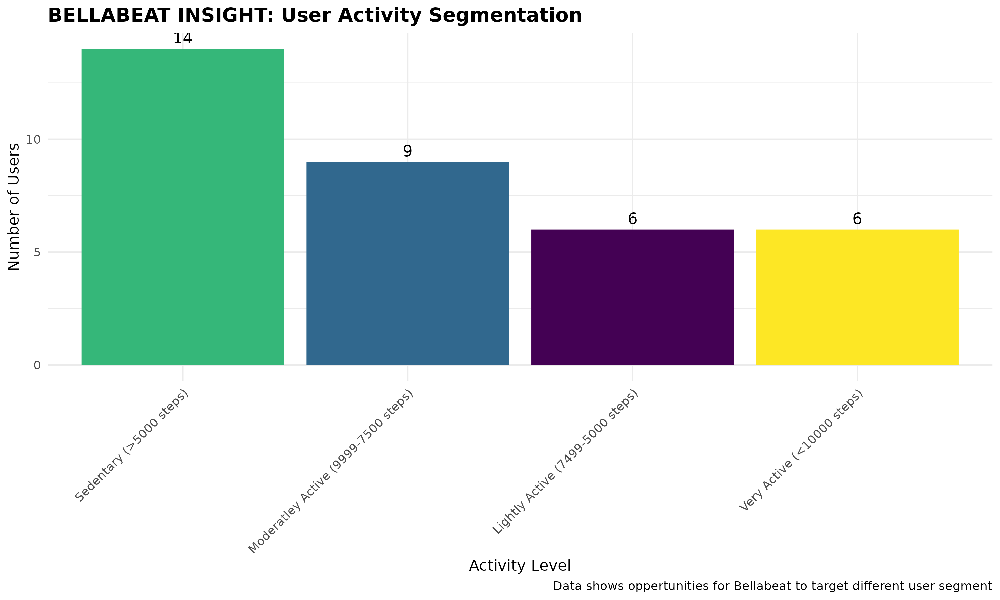
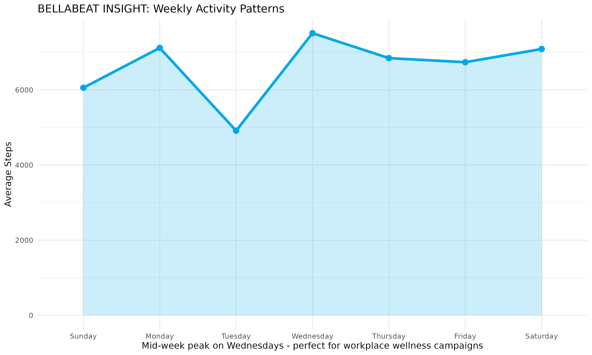
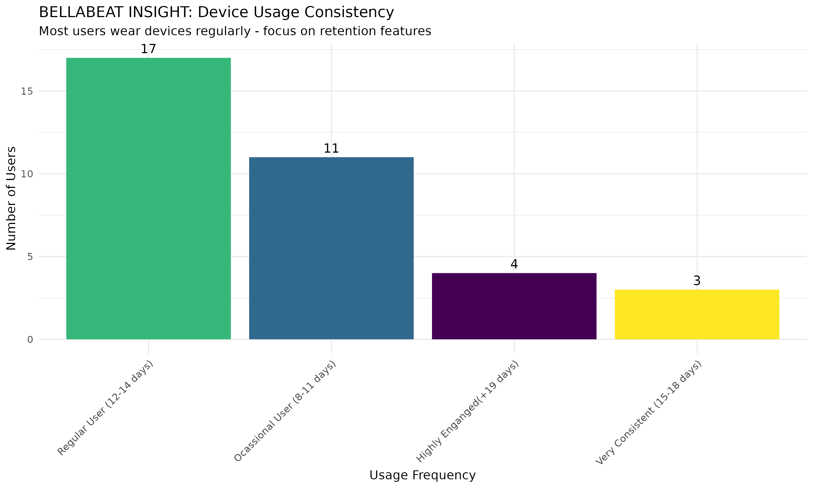

# bellabeat-fitness-analysis
Case study for Google Data Analytics Certificate - Analysing Fitbit data to provide marketing insights for Bellabeat
# Bellabeat Fitness Data Analysis

## Case Study for Google Data Analytics Certificate

### Business Task
Analyze Fitbit smart device usage data to identify trends and provide marketing strategy recommendations for Bellabeat's products.

### Data Sources
- **FitBit Fitness Tracker Data** (Kaggle)
- 33 users, March-April 2016
- Includes: daily activity, sleep, heart rate, steps

### Data Cleaning & Processing
- SQL queries in BigQuery for data aggregation
- Date/time parsing for consistent formatting
- Data joins for comprehensive analysis

### Key Insights

#### 1. User Activity Segmentation

- **Finding**: X users in [largest segment]
- **Implication**: Target this segment for Bellabeat marketing

#### 2. Weekly Activity Patterns  

- **Finding**: Peak activity on Wednesdays
- **Implication**: Ideal for mid-week wellness campaigns

#### 3. Device Usage Consistency

- **Finding**: X of users are daily users
- **Implication**: Focus on retention features

### 4. Hourly Activity Patterns
!

### Recommendations for Bellabeat
1. **Target mid-week engagement** with Wednesday wellness challenges
2. **Focus on [largest segment]** with tailored messaging
3. **Leverage peak hours** (6-7 PM) for reminder notifications
4. **Emphasize sleep tracking** as a key differentiator

### Tools Used
- **SQL**: BigQuery for data analysis
- **R**: ggplot2 for visualizations
- **GitHub**: Portfolio presentation

### Files
- `scripts/sql_queries.sql`: Complete analysis queries
- `scripts/r_analysis.R`: Visualization code
- [`data/`](data/): Processed datasets
- `visualizations/`: All charts and graphs
